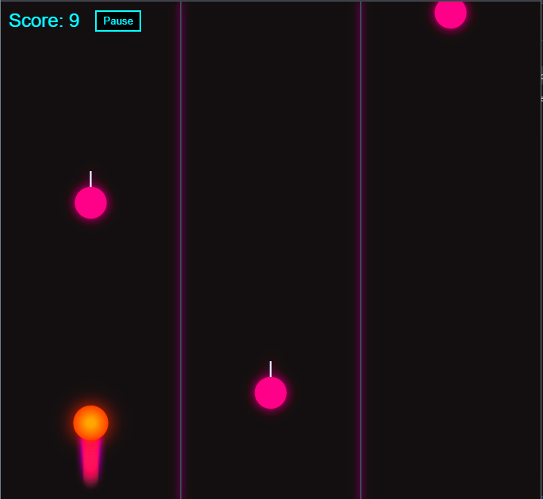

# 🚀 Neon Drift

**Neon Drift** is a fast-paced reflex racing game built entirely with HTML5, CSS, and JavaScript. Dodge neon bombs, drift through glowing lanes, and chase a high score in this cyberpunk-inspired mini arcade game.

## 🎮 How to Play

- Open index.html in any modern browser.
- **Goal**: Avoid the pink falling bombs and survive as long as possible.
- **Controls**:
  - `←` Move Left
  - `→` Move Right
  - `Space` or `Escape` to Pause/Resume
- **Scoring**: You earn 1 point every second you survive.

---

## 🎮 Features

- 🧠 Reflex-based arcade gameplay
- 🔥 Glowing fireball player with animated trail
- 💣 Falling bomb-like obstacles with directional arrows
- 🌌 Neon cyberpunk visuals with black/grey backgrounds
- 🎯 Scoring system with live HUD
- 🕹️ Pause & resume toggle
- 🖥️ Fully responsive canvas design

---

## 📸 Screenshot



---

## ✅ Getting Started

### 1. Clone the Repository

```bash
git clone https://github.com/Nomahk25/neon-drift.git
cd neon-drift
```

## 🚀 Optional Next Steps

- Add sound effects and background music  
- Implement touch controls for mobile  
- Store high scores in `localStorage`  
- Add difficulty levels or increasing speed  
- Add game over animations and retry screen  
- Firebase or backend scoreboards

---

## 💡 Inspiration

Neon Drift was inspired by the retro-futuristic aesthetics of synthwave music, Tron-style racers, and minimalist high-speed reflex games. The goal was to create a visually striking experience using only HTML, CSS, and JavaScript—no frameworks.

---

## 🤝 Contributing

Feel free to fork the project, improve it, and submit pull requests!

**Ideas:**
- New obstacle types (e.g., moving, blinking)
- Themes and unlockable visual modes
- Power-ups like shield or slow motion
- Multiplayer battle mode over WebRTC
- Add particle explosion on crash
- Implement day/night color mode
- Integrate power-ups (slow-mo, shield, etc.)
- Create alternate game modes (survival, time attack)

---

## 👤 Author

**Nomanguni Khumalo**  
Johannesburg, South Africa

---

## 📄 License

This project is licensed under the MIT License.  
Feel free to use, modify, and share it freely with attribution.
